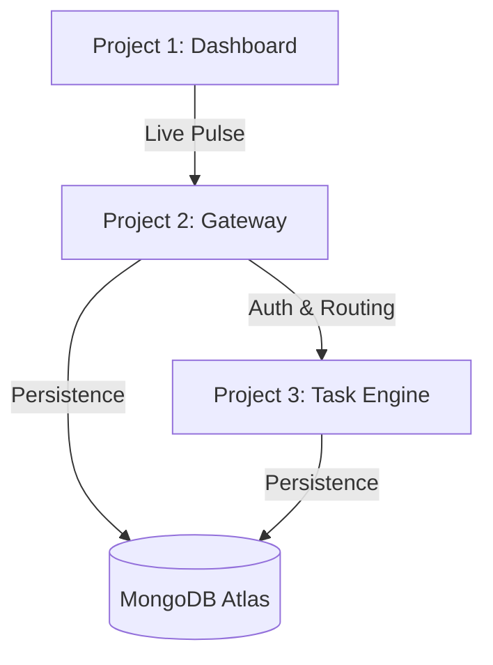

# Decode Labs - Full Stack Architectural Framework

This repository represents the **Decode Labs** strategic execution framework, built upon core architectural principles of security, resilience, and visual integrity.

## 🏗️ The Vision
Decode Labs is designed as a **Nervous System** for digital information, consisting of three specialized nodes:
- **Project 1 (The Visual Interface)**: An architectural dashboard for real-time monitoring and "Vital Signs" tracking.
- **Project 2 (The Brain Stem / Gateway)**: The central API Gateway handling AuthN, AuthZ, and stateless security.
- **Project 3 (The Neural Task Engine)**: A specialized microservice for "Relational Geometry" and complex state persistence (CRUD).

## 📊 System Architecture

## 📁 Repository Structure
- **[Project 1 (Frontend)](./project1/)**: High-fidelity architectural dashboard.
- **[Project 2 (Backend Gateway)](./project2/)**: RESTful API with integrated Auth and Validation.
- **[Project 3 (Database Integration)](./project3/)**: Microservice demonstrating complex CRUD and relational mapping.

## 🏛️ Core Principles
1. **The Gatekeeper**: Never trust the client. Enforced via Joi validation and JWT perimeter defense.
2. **The Blueprint**: Comprehensive API documentation (Swagger) for all backend services.
3. **Relational Geometry**: Mapping complex data relationships (1:1, 1:Many, M:M) with referential integrity.
4. **The Shield**: Data integrity enforced at the schema level to neutralize injection threats.

## 🛠️ Tech Stack
- **Frontend**: HTML5, CSS3 (Glassmorphism), Vanilla JavaScript.
- **Backend**: Node.js, Express, Microservices Architecture.
- **Persistence**: MongoDB Atlas (Mongoose ORM).
- **Security**: JWT, Bcrypt, Helmet, Rate Limiting, Syntactic Validation.
