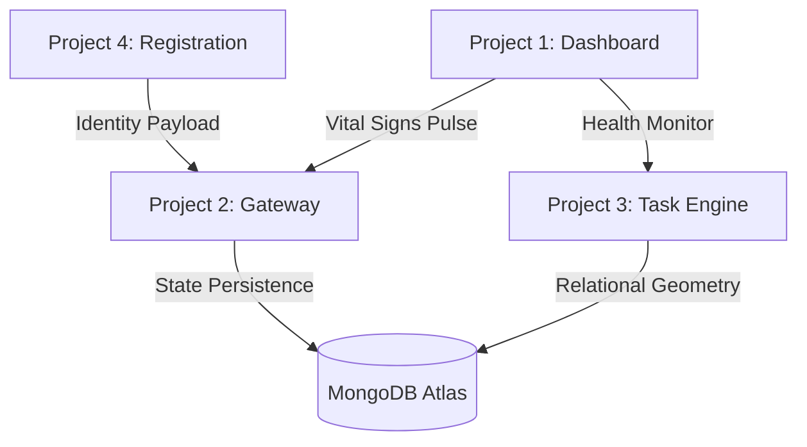

# AETHER NEXUS | The Ethereal Neural Ecosystem

Welcome to **AETHER NEXUS**, a state-of-the-art, high-performance execution framework. This repository is a high-fidelity, full-stack masterpiece designed to synchronize **Identity, Intelligence, and Visual Excellence.**

## 🌌 The Celestial Architecture
AETHER NEXUS is composed of four specialized, interconnected nodes that pulse with architectural integrity:

1.  **[Project 1: Command Center (Dashboard)](./project1/)**: The visual monitor for system "Vital Signs."
2.  **[Project 2: The Brain Stem (API Gateway)](./project2/)**: The central intelligence node handling AuthN, AuthZ, and Perimeter Defense.
3.  **[Project 3: Neural Task Engine (Microservice)](./project3/)**: A relational data engine managing complex state persistence.
4.  **[Project 4: Identity Gateway (Secure Registration)](./project4/)**: The frontline interface for secure user onboarding.

## 🏗️ Core Architectural Pillars
- **The Gatekeeper**: "Never Trust the Client." Every byte is validated by Joi (Syntactic) and JWT (Semantic) before entering the core.
- **Relational Geometry**: Complex data mapping (1:Many, Many:Many) with strict referential integrity.
- **The Shield**: Data integrity enforced at the database level to neutralize injection and malformed payloads.
- **The Communicator**: Inclusive, ARIA-tethered UI feedback for a production-grade user experience.

## 📊 Global System Flow

## 🛠️ Unified Tech Stack
- **Frontend**: Vanilla JS (ES6+), CSS3 (Glassmorphism), Semantic HTML5.
- **Backend**: Node.js, Express.js (Microservices architecture).
- **Persistence**: MongoDB Atlas (Cloud Cluster) with Mongoose ORM.
- **Security**: JWT (Stateless Identity), Bcrypt (Hashing), Helmet (Headers), Joi (Validation).

---
© 2025 AETHER NEXUS | Engineering the Architecture of Trust.
