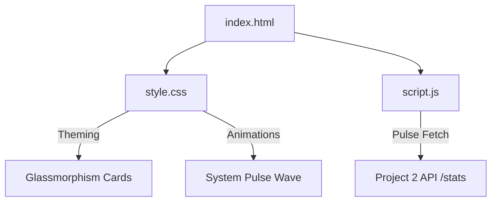

# Project 1: Gateway Visual Interface

The frontend component of the Decode Labs framework, serving as a real-time monitor for architectural integrity.

## 🎨 Design Philosophy
- **Palette**: Mocha Mousse (#A5956F), Ethereal Blue (#A0D4E0), Moonlit Grey (#F2F0EA).
- **Aesthetic**: 2025 "Warmth & Grounding" with Glassmorphism and Micro-animations.
- **Paradigm**: Mobile-First responsive execution.

## 📊 Component Diagram

## 🚀 Features
- **Vital Signs**: Real-time monitoring of system latency and database nodes.
- **Gatekeeper Status**: Visual confirmation of AuthN/AuthZ health.
- **Architectural Pulse**: Visual wave representing system stability.

## 🛠️ Usage
Simply open `index.html` in any modern browser. Ensure Project 2 is running to see live data updates.
