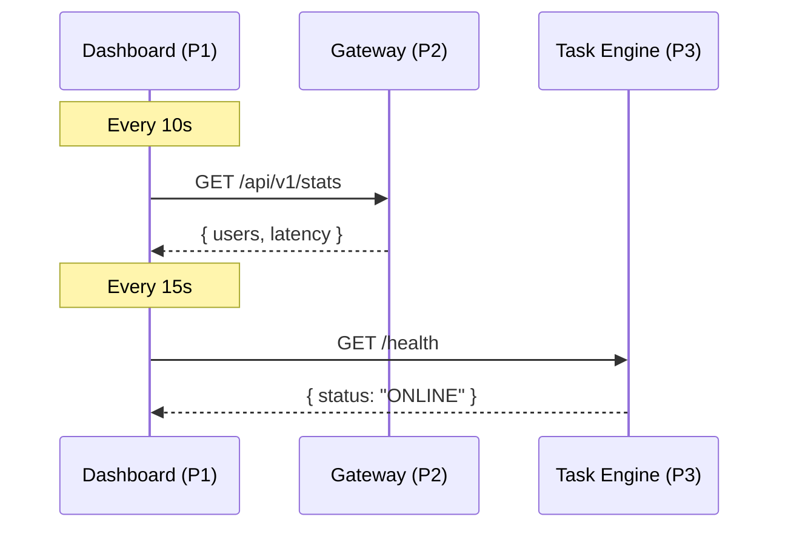

# Project 1: The Command Center (Dashboard)

The visual interface of the **AETHER NEXUS** ecosystem. This dashboard provides real-time visibility into the "Nervous System" of our distributed services.

## 🎨 Design System: Mocha Mousse
Built with a premium, state-of-the-art aesthetic:
- **Palette**: A curated mix of Mocha (#A5956F), Ethereal Blue (#A0D4E0), and Deep Brain Navy (#1A2238).
- **Glassmorphism**: High-blur backdrops and translucent borders for a modern SaaS feel.
- **Micro-animations**: Subtle pulse effects on "Vital Sign" cards to indicate active polling.

## 📡 Live Integration (Interconnectedness)
This dashboard is not static; it is the **System Communicator**:

1. **Gateway Pulse**: Every 10 seconds, it fetches real-time telemetry from **Project 2** (User counts, System Latency).
2. **Neural Engine Monitor**: Every 15 seconds, it pings the **Project 3** health-check endpoint.
3. **Unified Navigation**: Features a global sidebar that bridges the gap between the Command Center and the Identity Gateway (P4).

## 📊 Monitored Vital Signs
- **System Latency**: Real-time measurement of the API Gateway's response speed.
- **Cloud Nodes**: Active user count persisted in the MongoDB Atlas cluster.
- **Error Resilience**: Monitoring the status of backend circuit breakers and validation layers.
- **Neural Engine Status**: Live health status of the Task Engine microservice.

## 🚀 Deployment
Simply open `index.html`. For live stats, ensure **Project 2** and **Project 3** are running on their respective ports (3000 and 3001).
