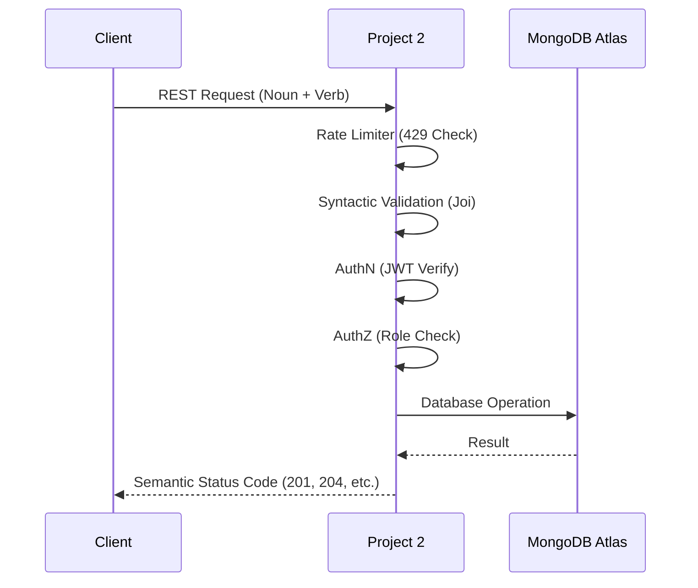

# Project 2: The Brain Stem (API Gateway)

The central processing hub for the Decode Labs ecosystem, enforcing security and architectural rules.

## 🛡️ The Gatekeeper Flow
All requests pass through a multi-layered security and validation pipeline before reaching the core logic.

## 🧩 Key Components
- **Routes**: RESTful naming conventions (Resources as Nouns).
- **Middlewares**: Helmet (Security), Morgan (Logging), Rate Limit (Resilience).
- **Controllers**: Logic separation (Auth, User, Stats).
- **Models**: Mongoose schemas with password hashing.

## 📜 Documentation
Interactive Swagger documentation is available at:
`http://localhost:3000/api-docs`

## 🚀 Setup
1. `npm install`
2. Create `.env` (refer to `.env.example`)
3. `npm run dev`
