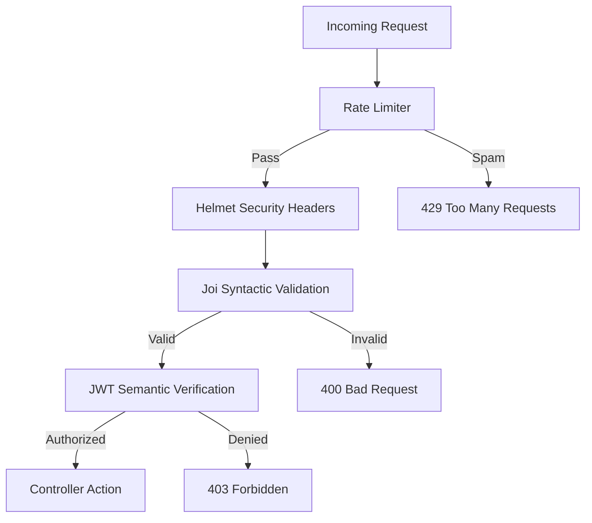

# Project 2: The Brain Stem (API Gateway)

The central intelligence and security node of **AETHER NEXUS**. This project implements the **Gatekeeper Protocol** to protect the ecosystem from the "Default Threat."

## 🛡️ The Gatekeeper Protocol
This service implements a multi-layered perimeter defense strategy to protect the ecosystem.



1. **AuthN (Authentication)**: Secure identity verification using **JWT (JSON Web Tokens)** and **Bcrypt** password hashing.
2. **AuthZ (Authorization)**: Role-Based Access Control (RBAC) ensuring only "Admin" identities can modify core blueprints.
3. **Syntactic Validation**: Utilizing **Joi** at the perimeter to inspect every incoming payload for structural integrity.
4. **Rate Limiting**: Defending the "Brain Stem" against brute-force attacks and volumetric floods.

## ⚙️ Core Modules
- **`authController`**: Manages the "Identity Fusion" process (Signup/Login).
- **`userRoutes`**: Secure endpoints for managing digital personas.
- **`statsRoutes`**: Telemetry provider for the Project 1 Dashboard.
- **`errorMiddleware`**: Centralized resilience engine to handle system anomalies gracefully.

## 📜 Blueprint (Documentation)
Standardized OpenAPI documentation available via Swagger:
`http://localhost:3000/api-docs`

## 🚀 Execution
```bash
npm install
npm run dev
```
Requires a `.env` file with `MONGODB_URI` and `JWT_SECRET` configured for Cloud Node connectivity.
