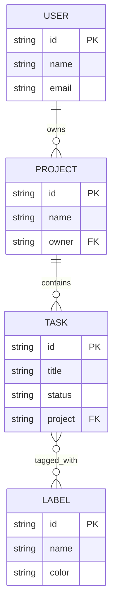

# Project 3: The Neural Task Engine

The specialized microservice for **Decode Labs**, focusing on deep database integration, relational geometry, and state persistence.

## 🏛️ Architectural Pillars
As defined in the project slides, this service fulfills the four pillars of backend mastery:
1. **The Blueprint**: Precise Mongoose schemas with relational linking.
2. **The Bridge**: Seamless integration via ORM and shared Cloud Persistence.
3. **The Action**: Full RESTful CRUD operations mapped to HTTP standards.
4. **The Shield**: Data integrity enforced via strict schema constraints and Joi validation.

## 📊 Relational Geometry (Schema)
This project demonstrates complex data relationships beyond simple user records.



## 🛡️ The Shield (Security)
- **Syntactic Validation**: Every request is screened by **Joi** before reaching the database.
- **Data Integrity**: Enforced `UNIQUE`, `NOT NULL`, and `minlength` constraints at the schema level.
- **Injection Neutralization**: ORM-based parameterization ensures all inputs are treated as data, never logic.

## 📜 Documentation
Interactive Swagger documentation is available at:
`http://localhost:3001/api-docs`

## 🚀 Setup & Execution
1. Ensure your `.env` is configured with the `MONGODB_URI`.
2. Install dependencies:
   ```bash
   npm install
   ```
3. Run the development server:
   ```bash
   npm run dev
   ```
   *Note: This service runs on **Port 3001** to coexist with the Project 2 Gateway.*
