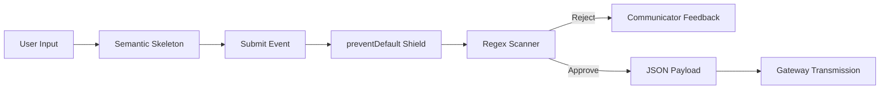

# Project 4: Identity Gateway (Secure Registration)

The frontline interface for the **AETHER NEXUS** ecosystem, engineered to implement the **Architecture of Trust**.

## 🏗️ The IPO Pipeline
This interface transforms raw human input into secure architectural payloads.

1. **Input (Structure)**: A semantic skeleton built with HTML5. No "haphazard divs"—only strict `<form>`, `<label>`, and `<input>` tags.
2. **Process (The Gatekeeper)**: Advanced JavaScript logic gates and **Regex Inspectors** that screen every character.
3. **Output (The Communicator)**: Dynamic, accessible UI feedback linked through the **Accessibility Tether**.

## 🛡️ Secure Engineering
- **Strict Password Policy**: A multi-stage regex ensuring Uppercase, Lowercase, Number, and Special Character complexity.
- **The Shield (preventDefault)**: Custom logic to override the "Default Threat" of uncontrolled browser refreshes, preserving the "Identity Payload."
- **ARIA Tethers**: Fully accessible error states using `aria-describedby` and `aria-live="polite"` to ensure no user is left behind.

## 🕸️ Ecosystem Fusion
This interface is the **Frontline of Authentication**:
- **Gateway Integration**: Successfully transmits validated payloads to the **Project 2 API** via a live `fetch` bridge.
- **Command Center Bridge**: Includes a navigation tether to return the user to the **Project 1 Dashboard**.

## 🚀 Execution
Open `index.html` in a modern browser. Ensure **Project 2** is running on Port 3000 for the Identity Fusion (Signup) to persist data to the Cloud.
